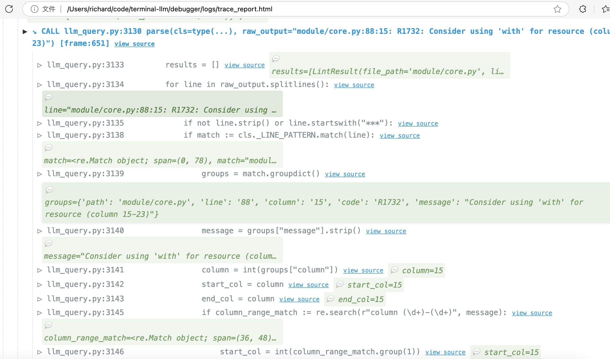

# Treehouse

[Chinese users please view README.md](README.md)

A code assistant tool based on OpenAI-compatible API, providing convenient command-line interaction and context-aware functionality. Designed to be a command-line version of Cursor and Windsurf, recommended to use with Deepseek R1.

## Usage Scenarios

Multiple `@` can be used after `askgpt` to mix contexts. You can use URLs while including file content without needing quotes, but beware of special shell characters like `>`

```bash
# Analyze clipboard content
askgpt Explain this code: @clipboard @tree

# Command suggestion
askgpt @cmd Find all files modified 2 hours ago and delete them

# Include current directory structure
askgpt "@tree, analyze the main modules"

# Include full directory structure with subdirectories
askgpt "@treefull, analyze the main modules"

# Embed file content
askgpt "Please optimize this config file: @config/settings.yaml"

# Access web pages
askgpt @https://tree-sitter.github.io/tree-sitter/using-parsers/1-getting-started.html Summarize this document

# Read news (uses readability tool to extract main content, requires browser forwarding setup - tutorial below)
askgpt @readhttps://www.guancha.cn/internation/2025_02_08_764448.shtml Summarize the news

# Embed common prompts (files stored in prompts/ directory)
askgpt @advice #This prompt asks GPT to provide modification suggestions

# Flexibly introduce prompt blocks, provide files, modify directories while including clipboard snippets
askgpt @advice @llm_query.py @clipboard Fix potential bugs

# Use custom context from prompts/ directory with auto-completion
askgpt @clipboard @comment

# Directory reference
askgpt @src Explain the structure of this React project

# Recent conversations
recentconversation
# Recent conversation history:
# 1) 2025-02-09 18:35:27 EB6E6ED0-CAFE-488F-B247-11C1CE549B12 What did I say earlier
# 2) 2025-02-09 18:34:37 C63CA6F6-CB89-42D2-B108-A551F8E55F75 hello
# 3) 2025-02-09 18:23:13 27CDA712-9CD9-4C6A-98BD-FACA02844C25 hello
# Select conversation (1-4, press Enter to cancel): 2
# Switched to conversation: C63CA6F6-CB89-42D2-B108-A551F8E55F75

# New conversation (default when opening new terminal)
newconversation

# Generate commit message for staged changes (PowerShell not supported yet)
commitgpt

# Ask without context (temporary query that doesn't affect current conversation)
naskgpt hello

# Clipboard listener - subsequent copies will be added to context (useful for writing materials)
askgpt @listen What trends do these user comments reflect?

# Repeat last prompt (useful for network issues or modifying questions)
askgpt @last

# Chatbot for casual conversation
chatbot

# Continue chatting (affected by newconversation)
chatagain

# Multi-line input (normally can use \ for line breaks)
naskgpt \
> hello \
> world

# File line selection (workaround for large files: first 100 lines, or 100-, 20-50)
naskgpt @large-file:-100

# Execute prompt file as script (if executable or starts with #!, stdout becomes context)
naskgpt @script.sh

# Symbol-related core functions (require symbolgpt server)
# Start symbol service (tree.py)
symbolgpt
symbolgptrestart

# @patch indicates response contains symbols to patch
askgpt @patch @symbol_tree.py/ParserUtil When traverse encounters function_definition node, additionally check if parent is decorated_definition

# Symbol completion (supports bash/zsh/PowerShell)
askgpt @symbol_file/symbol 

# Specify symbol by line number (anonymous functions can use line number directly)
askgpt @symbol_llm_query.py/at_4204

# Specify symbol by line number including parent node
askgpt @symbol_llm_query.py/near_4215

# Fix code bugs (generates diff for patching)
askgpt @edit @edit-file @main.py Find and fix potential bugs

# Same as above
codegpt @main.py Find and fix potential bugs

# Rewrite symbol (patchgpt is shorthand for naskgpt @patch)
patchgpt @symbol_file/symbol Fix bugs

# Rewrite symbol with LSP context
patchgpt @context @symbol_file/symbol Fix bugs

# Command execution error checking and diagnosis
fixgpt 

# Project search with ripgrep and automatic symbol location
patchgpt ..LintFix.. ..main.. Add test suite

# Class/function location completion
patchgpt ..MyClass.. Complete this test suite based on description
```

## Features

- **Code Generation**: Implements Cursor/Windsurf code generation using AST/LSP for precise context
- **Conversation Saving/Switching**: Follow-up questions and session restoration
- **Powerful Symbol Reference**: Modify code by symbols (classes/functions) then diff/patch
- **Rich Context Integration**:
  - Clipboard content (@clipboard)
  - Directory structure (@tree/@treefull)
  - File embedding (@filepath)
  - Web content (@http://example.com)
  - Common prompts (@advice)
  - Command suggestions (@cmd)
  - Code editing (@edit)
- **Web Content Conversion**:
  - Browser extension integration bypasses Cloudflare
  - Automatic content extraction and formatting
- **Obsidian Support**: Saves history to specified directory
- **Multi-model Switching**: Config file for local ollama 14b/32b or remote R1
- **Advanced Debugging**: Python line-level tracing with variable changes

## Installation & Configuration

1. **Clone Repository**
```bash
git clone https://github.com/maliubiao/terminal-llm
cd terminal-llm
```

2. **Setup Virtual Environment**
```bash
# Windows: powershell -ExecutionPolicy ByPass -c "irm https://astral.sh/uv/install.ps1 | iex"
# Mac/Linux: curl -LsSf https://astral.sh/uv/install.sh | sh
uv sync
source .venv/bin/activate
```

3. **Environment Variables**
```bash
# Add to shell config (~/.bashrc or ~/.zshrc)
export GPT_PATH="/path/to/terminal-llm"
export GPT_KEY="your-api-key"
export GPT_MODEL="your-model"
export GPT_BASE_URL="https://api.example.com/v1"  # OpenAI-compatible API
source $GPT_PATH/env.sh  # Enables @ completion in zsh/bash
```

4. **Windows PowerShell Usage**  
PowerShell's `@` has a special meaning and cannot be directly used for completion. You need to use `\@` instead, which adds an extra character compared to directly using `@`.

```powershell
# PS C:\Users\user> $PROFILE
# This variable returns the current configuration file. Add env.ps1 to the configuration file.
[Console]::InputEncoding = [Console]::OutputEncoding = [System.Text.Encoding]::UTF8
. \your\path\to\env.ps1
```

### R1 API Providers
[ByteDance Ark](https://www.volcengine.com/experience/ark) - Fastest response, lowest cost  
[SiliconFlow](https://cloud.siliconflow.cn) - High-performance API (may experience congestion)  
[Tutorial](https://docs.siliconflow.cn/usercases/use-siliconcloud-in-chatbox)  

## Project Configuration
```yaml
# Example LLM project search config (.llm_project.yml)
# Project root directory (must contain .llm_project.yml)
project_root_dir: /path/to/your/project
lsp: # LSP configuration
  commands: # LSP startup commands
    py: pylsp
    clangd: clangd
  subproject: # Subdirectory LSP
    debugger/cpp/: clangd 
  default: py # Default LSP
  suffix:
    cpp: clangd # Suffix-based LSP matching
exclude:
  dirs:
    - .git
    - .venv
    - node_modules
    - build
    - dist
    - __pycache__
    - conversation
    - obsidian
    - web
  files:
    - "*.min.js"
    - "*.bundle.css"
    - "*.log"
    - "*.tmp"
include:
  dirs: []
  files:
    - "*.py"
    - "*.cpp"
    - "*.js"
    - "*.md"
    - "*.txt"
file_types:
  - .py
  - .js
  - .md
  - .txt
  - .cpp
```

## Model Switching

```bash
# Create model.json in the same directory. After configuring model.json, you no longer need to set GPT_* environment variables.
# The "default" provider or the first one in the list will be used.
➜  terminal-llm git:(main) ✗ listgpt 
14b: deepseek-r1:14b
➜  terminal-llm :(main) ✗ usegpt 14b
Successfully set GPT environment variables:
  GPT_KEY: olla****
  GPT_BASE_URL: http://192.168.40.116:11434/v1
  GPT_MODEL: deepseek-r1:14b
```

```
// The max_context_size varies significantly between models. Some models support only up to 8192 or even as low as 4k.
// Setting it too high will result in errors. max_context_size refers to the context size, while max_tokens refers to the output size.
// Different API providers may have different parameters.
// Temperature greatly affects the response style. For programming questions, set it to 0.0. For literary tasks, set it to 0.6, as officially recommended.
// is_thinking indicates whether the model is a reasoning model. Reasoning models don't require complex prompts as they can infer on their own (e.g., r1 is reasoning, v3 is not).
```

```json
{
    "14b": {
        "key": "ollama",
        "base_url": "http://192.168.40.116:11434/v1",
        "model_name": "r1-qwen-14b:latest",
        "max_context_size": 131072,
        "temperature": 0.6,
        "max_tokens": 8096,
        "is_thinking": false
    }
}
```

## Advanced Features

**Web Conversion Service**
```bash
python server/server.py  # Default port 8000
curl "http://localhost:8000/convert?url=URL"

# Firefox Readability
cd node; npm install; npm start  # Port 3000
```

**Element Filtering**
When dealing with web pages that contain a lot of irrelevant content, such as external links, it can waste context space. Many APIs have an 8k context limit, making it difficult to include everything. In such cases, you can define custom CSS or XPath selectors to instruct the conversion service on which parts of the page to focus on. 

XPath selectors are particularly powerful for handling obfuscated web structures. The web conversion service includes an element filter, which can be configured in `server/config.yaml`. Additionally, when using the built-in element selector, you can save your selections directly, and the plugin will automatically refresh the `server/config.yaml` file.
```yaml
filters:
    - pattern: https://www.guancha.cn/*/*.shtml
      cache_seconds: 600
      selectors:
        - "div.content > div > ul"
    - pattern: https://x.com/*/status/*
      selectors:
        - "//article/ancestor::div[4]"
```

**Plugin Configuration**  
load plugin `server/plugin`  
Click the plugin icon to open the options menu. You can load an element selector on the current page, which helps you locate the desired content's CSS selector and copy it into `config.yaml`.  
If you are familiar with using the DevTools inspector, you can use it to copy the selector directly.  

### Starting the Tree Service for a New Project

In the project's root directory, execute the following commands. If `.llm_project.yml` is not configured, a default configuration file will be generated. This file specifies how to use the language server and the search configuration for ripgrep.

```bash
symbolgpt
symbolgptrestart
```

Alternatively, you can manually start the service:

```bash
# Create a new .llm_project.yml and configure the LSP
$GPT_PYTHON_BIN $GPT_PATH/tree.py --port 9060
# GPT_PYTHON_BIN and GPT_PATH are environment variables set in env.sh, pointing to the terminal-llm directory
export GPT_SYMBOL_API_URL=http://127.0.0.1:9060
# Use @symbol_file.xx/main in askgpt to retrieve symbol context. Bash and Zsh shells support auto-completion for symbols, making it more convenient.
```

## Advanced Debugger

Supports bytecode-level line tracing for Python programs, showing which lines were executed and tracking variable changes. The performance is optimized to avoid significant slowdowns.

### Compilation
```bash
# Python 3.11.11 is recommended as the C++ code accesses internal Python VM data. 
# Using a different version may cause crashes.
cd terminal-llm
source .venv/bin/activate
cd debugger/cpp

# If compilation fails, join the QQ group for support. If the documentation doesn't work as expected, provide feedback in the group.
cmake ../ -DCMAKE_BUILD_TYPE=Debug -DENABLE_ASAN=ON  # Debug build with AddressSanitizer
# or
cmake ../ -DCMAKE_BUILD_TYPE=Release
```

### Usage
```bash
# Run the debugger with file watching and open the report
python -m debugger.tracer_main --watch-files="*path.py" --open-report test_llm_query.py
```


## Custom Prompts
Create templates in `prompts/` directory:
```py
#! /usr/bin/env python
print("You are a helpful assistant")
```

## Environment Variables

| Variable       | Description                      |
|----------------|----------------------------------|
| `GPT_PATH`     | Project root directory          |
| `GPT_KEY`      | OpenAI API key                  |
| `GPT_BASE_URL` | API base URL (default Groq)     |
| `GPT_KEY`      | API KEY                         |

```bash
env | grep GPT_
```

## Notes

1. **Optional Tools**:
   - Install `tree` command for directory structure
  - Install `diff` and `patch` tools for source code operations. These tools may not be available by default on Windows.

2. **Proxy Configuration**:
   Automatically detects `http_proxy`/`https_proxy`

3. **Web Conversion Requirements**:
   - Requires Chrome browser extension
   - Ensure port 8000 is available
   - Only accepts local connections

## terminal-llm Group


## License
MIT License © 2024 maliubiao
