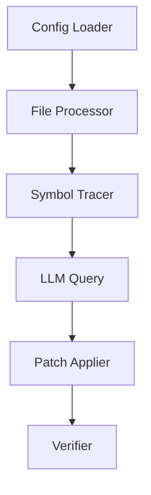

# System Design

## Architecture Overview



## Core Components

### 1. Config Loader
- Loads YAML configuration
- Handles file patterns and exclusions
- Manages verification commands

### 2. File Processor
- Parallel file processing
- Symbol extraction
- Dependency tracking

### 3. Symbol Tracer
- Per-symbol transformation
- Batch processing
- CRC32 checksum tracking

### 4. LLM Integration
- Prompt construction
- Response parsing
- Error handling

### 5. Patch Applier
- Atomic file updates
- Change verification
- Rollback support

### 6. Verification System
- Compilation testing
- Runtime validation
- Error recovery

## Data Flow

1. Configuration → File List
2. File → Symbol List
3. Symbol → Transformation
4. Transformation → Patched File
5. Patched File → Verification

## Threading Model

- File-level parallelism
- Thread-safe transformation storage
- Batch processing of symbols

## Transformation Storage

```
trace_debug/
  file_transformations/
    file1_transformations.json
    file2_transformations.json
```

Each file contains:
- Original and transformed code
- Symbol metadata
- Change status

## Error Handling

- CRC32 checksum validation
- Symbol-level rollback
- Failed transformation logging