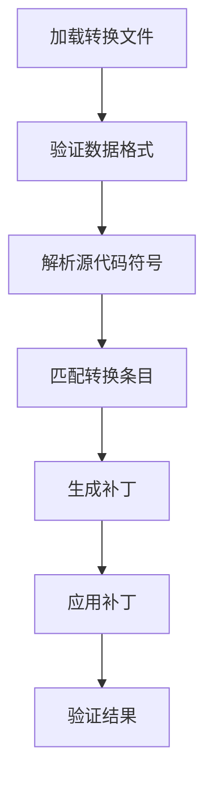

# 设计文档

## 路径处理设计

### 符号标识方案
系统使用统一格式的符号键来标识代码符号：
```
<绝对文件路径>/<符号名称>
```
例如：
```
/Users/richard/code/terminal-llm/gpt_workflow/code_trace/test.cpp/add
```

### 关键设计决策
1. **绝对路径优先**：
   - 所有内部处理使用绝对路径
   - 配置文件可以接受相对路径，但会转换为绝对路径

2. **转换存储格式**：
   - 转换文件(`*_transformations.json`)使用绝对路径存储符号键
   - 确保跨机器和环境的可移植性

3. **符号匹配规则**：
   - 严格匹配完整符号键
   - 支持通配符跳过符号(在skip_symbols中)

### 多文件处理
1. 每个文件有独立的转换文件
2. 并行处理时使用文件锁确保线程安全
3. 全局统计信息汇总所有文件转换结果

## 转换应用流程



### 错误处理
1. 路径不匹配：记录警告并跳过
2. 转换验证失败：恢复原始文件
3. 部分应用：支持重试机制